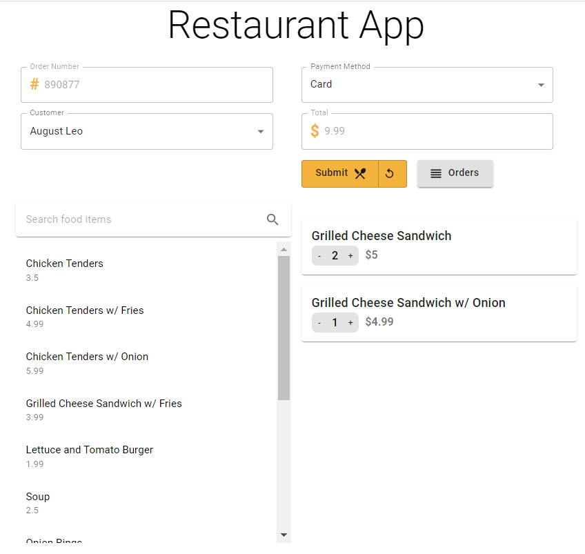
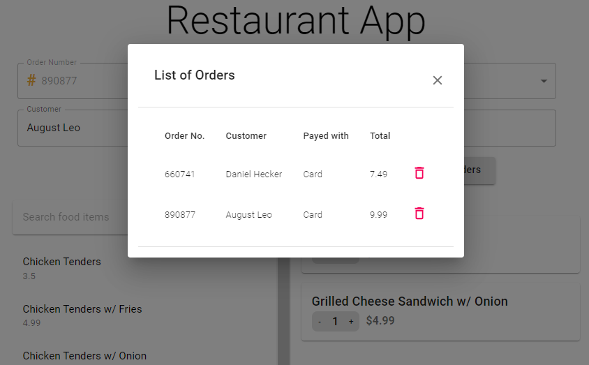

# RestaurantApp

## Overview

The application simulates a food ordering system. It is composed of a backend REST API (Asp Net Core WebApi with EntityFramework) and a frontend app created with _React_ and _Material UI_.
The frontend app uses _axios_ to call the backend api.

Orders can be created, updated and deleted.

The project is build based on these 2 tutorials:

- [Complete React JS Master Detail CRUD with Asp.Net Core API](https://www.youtube.com/watch?v=i8LymADs_U4&t=248s)
- [Perfect Master Detail CRUD in React JS with a Restaurant App](https://www.youtube.com/watch?v=z5NsNtrl4Og&t=10170s)

[Github](https://github.com/CodAffection/React-js-Master-Detail-CRUD-with-Asp.Net-Web-API)

## Setup

The Asp Net Core WebApi project uses SQL server. In order to create the database and tables, from Nuget Manager Console run: `Update-Database`.

(Optional) When doing a change to the database, from Nuget Manager Console run: `Add-Migration "Description of the change"`
